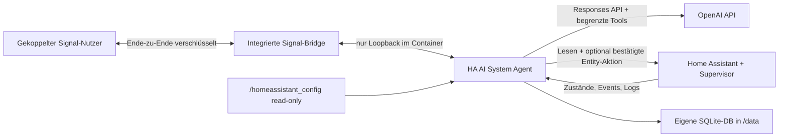

# HA AI System Agent

<p align="center">
  
</p>

Ein Home-Assistant-Add-on, in dem ein OpenAI-Agent lebt, per Signal chattet und Home Assistant überwacht. Der Agent darf Zustände, Verlauf, Konfigurationen und Logs lesen. Optional kann eine streng begrenzte, separat bestätigte Geräte-/Entity-Steuerung aktiviert werden. **Automationen, Skripte, Szenen, Systemfunktionen und Konfigurationsdateien bleiben unveränderbar.**

Status: experimentelle, gehärtete Version für Home Assistant OS/Supervised auf `amd64` und `aarch64`.



## Was bereits funktioniert

- Signal-Nachrichten von einer Whitelist empfangen und beantworten
- Signal-Konto per QR-Code direkt in der Admin-Oberfläche verbinden
- Persönliche Absender mit einem fünf Minuten gültigen Einmalcode koppeln
- Eigene Home-Assistant-Weboberfläche für sämtliche Einstellungen und Verbindungstests
- Aktuelle Entities suchen und Zustände/Attribute lesen
- Kompakten Entity-Verlauf bis sieben Tage lesen
- Home-Assistant-Core-Logs sowie gemountete Logdateien lesen und filtern
- Konfigurationsdateien auflisten, lesen, durchsuchen und auf YAML-Syntax prüfen
- Persistente fünfstellige Cron-Jobs nach separater Signal-Bestätigung anlegen
- Mehrere Geräte auf `unavailable`, `unknown` oder andere Zustände überwachen
- Beliebige Home-Assistant-Events mit einfachen Datenfiltern abonnieren
- Monitore auflisten, deaktivieren, aktivieren und löschen
- Wichtige Aussagen des jeweiligen Signal-Nutzers in einer begrenzten lokalen Wissensbasis behalten
- Pro Entity lokale Verhaltens-Baselines bilden und auffällige Werte, häufige Zustandswechsel oder anhaltende Ausfälle melden
- Home-Assistant-Ereignisse validieren, deduplizieren und in einer begrenzten lokalen Queue verarbeiten
- Semantische Entity-Profile aus Entity-, Device- und Area-Registry mit Herkunft und Konfidenz aufbauen
- Kontextbezogene Baselines nach Saison, Wochentag und Tageszeit sowie robuste Z-/MAD-Abweichungen berechnen
- Verfügbarkeit, ausbleibende Updates und Zustandsfrequenz als nachvollziehbare Detektor-Evidenz erkennen
- Read-only Automationen zu Abhängigkeiten und erwarteten Wirkungen mit Herkunft/Konfidenz auswerten
- Konfigurierbare Zustandsautomaten, Betriebszyklen und Aktuator-Sensor-Wirkungen überwachen
- Geschwärzte Logmeldungen lokal zu Templates clustern und ungewöhnliche Häufungen erkennen
- Zusammenhängende Befunde zu priorisierten Incidents gruppieren und bei Recovery automatisch auflösen
- Incidents strukturiert interpretieren, dedupliziert über Signal melden und mit Feedback/Entwarnung verwalten
- Tages-/Wochenzusammenfassungen, Admin-Ansichten und einen aktionsfreien Replay-Modus bereitstellen
- Komponenten-Health, Readiness und Prometheus-Metriken über die Admin-Oberfläche bereitstellen
- Optionale Geräte-/Entity-Steuerung mit fester Domain-/Aktionsliste, verpflichtender Entity-Allowlist und separatem Signal-Code
- Neustarts überstehen; Monitore liegen in `/data/agent.sqlite3`

Nicht enthalten sind allgemeine Service Calls, Shell-Zugriff, Event-Auslösung, Dateiänderungen, Home-Assistant-/Add-on-Neustarts oder Schreibzugriffe auf Automationen, Skripte, Szenen und Helfer.

## Voraussetzungen

- Home Assistant OS oder eine Supervised-Installation mit Add-on-Unterstützung
- Ein OpenAI-API-Key. Ein ChatGPT-Abonnement allein ist kein API-Guthaben.
- Sinnvollerweise ein eigenes Signal-Konto für den Bot

Signal stellt keine offizielle Bot-API bereit. `signal-cli` und der REST-Wrapper sind Community-Projekte; Änderungen bei Signal können die Verbindung vorübergehend unterbrechen.

## 1. Add-on installieren

Für die normale Installation diese Repository-URL unter **App-Store → Repositories** hinzufügen:

```text
https://github.com/SVENS0Nb/HA-AI-System-Agent
```

Danach im App-Store nach **HA AI System Agent** suchen und die App installieren.

### Lokale Installation

Für einen ersten Test den Unterordner [`homeassistant-readonly-agent`](./homeassistant-readonly-agent) in Home Assistants `/addons/homeassistant-readonly-agent` kopieren, beispielsweise über das Samba- oder SSH-Add-on. Danach:

1. **Einstellungen → Apps → App-Store** öffnen.
2. Im Menü **Nach Updates suchen** wählen.
3. Unter **Lokale Apps** den **HA AI System Agent** öffnen und installieren.
4. Das Add-on starten; eine unvollständige Konfiguration startet zunächst nur die sichere Einstellungsoberfläche.
5. **Weboberfläche öffnen** wählen und dort Signal, OpenAI, Datenschutz und Laufzeit konfigurieren.
6. **Einstellungen speichern** und anschließend die drei Verbindungstests ausführen.

Das Repository enthält bereits die für den Home-Assistant-App-Store erforderliche `repository.yaml` mit der öffentlichen Projektadresse.

## 2. Signal automatisch verbinden

Im Standardmodus wird die Signal-Bridge innerhalb desselben Add-on-Containers gestartet. Sie ist nur über `127.0.0.1` erreichbar; es wird kein Signal-Port in das Heimnetz oder Internet veröffentlicht. Der dauerhafte Signal-Daemon verwendet die native, speicherschonende Ausführung und benötigt zur Laufzeit keine Java-VM.

1. In der Add-on-Seite **Weboberfläche öffnen** wählen.
2. Unter Signal **Integriert – automatisch** auswählen.
3. **Signal-Konto verbinden** anklicken.
4. Den angezeigten QR-Code in der Signal-App des gewünschten Kontos unter **Einstellungen → Verknüpfte Geräte** scannen.
5. Für ein persönliches Konto **Eigenen Chat „Notiz an mich“ verwenden** aktivieren und speichern. Alternativ zeigt die Oberfläche einen Befehl wie `KOPPELN A1B2C3D4`.
6. Den Kopplungsbefehl von einem anderen Signal-Konto senden, wenn zusätzliche Absender zugelassen werden sollen. Selbst-Chat und erlaubte Absender können gleichzeitig aktiv sein.

Der Kopplungscode ist acht Hex-Zeichen lang, nur fünf Minuten gültig und wird ausschließlich in der admin-geschützten Ingress-Oberfläche angezeigt. Zusätzliche Absender lassen sich über **Weiteren Absender koppeln** freigeben. Die Verknüpfung bleibt nach Neustarts erhalten.

Der Selbst-Chat ist standardmäßig deaktiviert. Der Agent akzeptiert dort ausschließlich Signal-Synchronisationsnachrichten, die eindeutig an die eigene Kontonummer adressiert sind. Andere selbst gesendete Unterhaltungen werden ignoriert. Agentenantworten im Selbst-Chat tragen eine feste Kennzeichnung und werden nicht erneut als Auftrag verarbeitet. Normale eingehende Chats bleiben auf `allowed_senders` begrenzt.

**Signal lokal trennen** entfernt ausschließlich die lokale Geräteverknüpfung und alle Absenderfreigaben; das eigentliche Signal-Konto wird nicht gelöscht. Der alte Geräteeintrag kann anschließend zusätzlich in der Signal-App entfernt werden.

Unter **Externe Bridge – Expertenmodus** kann weiterhin eine selbst betriebene `signal-cli-rest-api` verwendet werden. Nur in diesem Modus werden API-URL und optionaler Proxy-Token benötigt.

## 3. Einstellungsoberfläche

Die Weboberfläche wird durch Home Assistant Ingress bereitgestellt. Jeder Aufruf wird serverseitig anhand der von Home Assistant übergebenen Benutzer-ID gegen die aktuelle Administratorliste geprüft; `panel_admin` allein wird nicht als Sicherheitsgrenze verwendet. Port `8099` wird nicht nach außen veröffentlicht. Änderungen werden mit Dateirechten `0600` in `/data/ui-settings.json` gespeichert und der Agent wird automatisch neu geladen.

API-Keys und Proxy-Tokens werden nie wieder an den Browser zurückgegeben. Ein leeres Passwortfeld behält den bereits gespeicherten Wert bei. Ausnahme: Wird die Signal-URL geändert, wird ein vorhandener Proxy-Token nicht an das neue Ziel übernommen. Die Verbindungstests prüfen Home Assistant, Signal und OpenAI getrennt, sodass eine noch unvollständige andere Verbindung den jeweiligen Test nicht blockiert.

Die native Registerkarte **Konfiguration** bleibt als Fallback erhalten. Werte aus der eigenen Weboberfläche haben Vorrang.

Die Reasoning-Steuerung arbeitet standardmäßig adaptiv. Sie bewertet ausschließlich den aktuellen Benutzerauftrag beziehungsweise die gespeicherte Monitoraufgabe. Nicht vertrauenswürdige Inhalte aus Logs, Konfigurationsdateien oder Eventdaten dürfen die Reasoning-Stufe nicht bestimmen. Aufwendige Werkzeuge und Werkzeugfehler können den nachfolgenden Modellaufruf strukturell bis maximal `high` hochstufen. Die Einstufung selbst läuft lokal und erzeugt deshalb keine zusätzliche OpenAI-Anfrage.

### Lokales Lernen und Wissensbasis

Wenn **Lokales Lernen** aktiviert ist, verarbeitet das Add-on `state_changed`-Ereignisse zu kompakten statistischen Baselines. Numerische Sensoren erhalten einen gleitenden Mittelwert und eine Streuung; nichtnumerische Entities werden auf ungewöhnlich häufige Zustandswechsel und anhaltendes `unavailable`/`unknown` geprüft. Rohereignisse werden dafür nicht dauerhaft als Lernhistorie gespeichert. Ist die **Intelligente Überwachung** aktiv, übernimmt deren Incident-Pipeline diese Verhaltensanalyse; die ältere Einzelanomalie-Pipeline wird dann nicht zusätzlich gestartet und erzeugt keine doppelten Meldungen.

Die Wissensbasis ist pro freigegebenem Signal-Absender getrennt. Der Agent darf ausschließlich einen exakten Ausschnitt der gerade authentifiziert empfangenen Nutzernachricht speichern – niemals Anweisungen aus Logs, Konfigurationsdateien, Events, Werkzeugergebnissen, eigenen Antworten oder Gesundheitsdaten. Diese Grenze wird zusätzlich lokal geprüft. Er wählt für geeignete Präferenzen, Korrekturen, beschriebenes Normalverhalten und wichtigen Kontext eine Wichtigkeit sowie eine begrenzte Lebensdauer. Abgelaufene Einträge werden automatisch gelöscht; ein Nutzer kann einen Eintrag jederzeit mit einer ausdrücklichen Bitte wie „Vergiss …“ entfernen lassen. Routinegespräche sollen nicht dauerhaft gespeichert werden.

Das Lernen ist eine heuristische Entscheidungshilfe, kein Beweis für einen Defekt. Neue oder selten geänderte Entities benötigen zunächst genügend Beobachtungen. Die Stufen **Konservativ**, **Ausgewogen** und **Empfindlich** steuern Aufwärmphase und Meldeschwellen; bei Fehlalarmen sollte zunächst eine konservativere Stufe gewählt werden.

### Intelligente Überwachung und Incidents

Die zusätzliche **Intelligente Überwachung** verarbeitet den reconnect-fähigen Home-Assistant-Eventstream in einer begrenzten Pipeline. Regelmäßige aktuelle Zustands-Snapshots gleichen Stream-Unterbrechungen und kontrolliert verworfene Normalereignisse ab. Die Pipeline normalisiert und dedupliziert Ereignisse, reichert Entities mit Registry-Metadaten an, berechnet Rolling Features und vergleicht Messwerte erst nach einer konfigurierbaren Aufwärmphase mit globalen und kontextbezogenen Baselines. Bereits beim Start aktive Sicherheitsalarme werden sofort ausgewertet. Verfügbarkeitsbefunde benötigen standardmäßig 15 Minuten Persistenz; ausbleibende Updates werden erst geprüft, wenn ein typisches Intervall gelernt wurde.

Unabhängige Detektoren liefern strukturierte Evidenz mit Messwert, Referenz, Stichprobenzahl, Schwelle, Score und Konfidenz. Der Incident Manager gruppiert gemeinsame Integrations-, Geräte-, Bereichs- oder Korrelationsfehler, berechnet eine mehrdimensionale Kritikalität und löst Verfügbarkeits-Incidents nach Recovery wieder auf. Diese Entscheidungen erfolgen vollständig lokal und deterministisch; ein LLM wird nicht pro Zustandsänderung aufgerufen.

Zusätzlich analysiert das System read-only Automationen und Packages zu einem gerichteten Abhängigkeitsgraphen, prüft freigegebene Zustandsautomaten, lernt robuste Betriebszyklusdauern, kontrolliert erwartete Aktuator-Sensor-Wirkungen und clustert nur begrenzte, geschwärzte Core-Logausschnitte. Neue oder stark zunehmende Logcluster werden wie andere Befunde in die Incident-Engine geleitet.

Materiale Incidents erhalten optional eine strikt schema-validierte OpenAI-Analyse aus einem begrenzten relevanten Kontext. Bei API-, Refusal- oder Validierungsfehlern bleibt eine deterministische lokale Erklärung und Benachrichtigung verfügbar. Proaktive Signal-Meldungen werden je Empfänger dauerhaft dedupliziert, nach Fehlern wiederholt, bei Verschlechterung eskaliert, nach Cooldown erneut gesendet und optional automatisch entwarnt. Ruhezeiten, dringende Ausnahmen und Wartungsmodus sind konfigurierbar.

Im Signal-Chat kann der Agent Incidents, Anomalien, Profile/Baselines, Abhängigkeiten, Betriebszyklen, Zusammenfassungen und Health abfragen. Feedback und Bestätigung eines Incidents benötigen – wie andere interne Mutationen – exakte Evidenz aus der aktuellen Signal-Nachricht und einen separaten `BESTÄTIGEN`-Code. Geschützte Sicherheitsbefunde lassen sich nicht automatisch wegtrainieren. Die Admin-Oberfläche bietet dieselben Ansichten und Feedbackwege; JSONL-Replay testet Detektoren ohne live Home Assistant oder Aktionszugriff.

Die Admin-Oberfläche bietet `/api/health` und `/metrics`; minimale Supervisor-Probes liegen unter `/health/live` und `/health/ready`. Architektur, Datenmodell und Detektoren sind im Verzeichnis [`docs`](./docs) dokumentiert.

### Optionale Geräte- und Entity-Steuerung

Die Gerätesteuerung ist nach Installation und Update ausgeschaltet. In der Admin-Oberfläche kann **Bestätigte Gerätesteuerung aktivieren** gewählt werden; dabei muss mindestens eine konkrete Entity-ID freigegeben sein. Eine leere Liste erlaubt keine Aktion. Unterstützt werden ausschließlich die fest definierten Aktionen der Domains `light`, `switch`, `fan`, `cover`, `climate`, `humidifier`, `media_player`, `vacuum`, `lock`, `siren`, `valve`, `water_heater`, `number` und `select`.

Der Agent kann keinen Domain- oder Servicenamen frei erfinden. Jede Kombination aus Domain, Aktion und Parameter wird durch eine lokale feste Zuordnung geprüft; numerische Werte müssen innerhalb globaler und – sofern vorhanden – der von der Entity gemeldeten Grenzen liegen. Modi und Optionen müssen von der Entity aktuell angeboten werden. `automation`, `script`, `scene`, `button`, `input_*`, `alarm_control_panel`, `update`, `homeassistant`, Supervisor-/Add-on-Dienste sowie Dateioperationen sind nicht Teil dieses Steuerpfads.

Auch eine erlaubte Aktion wird nur vorgeschlagen. Sie muss aus dem exakten Wortlaut der aktuellen authentifizierten Signal-Nachricht hervorgehen und wird erst durch eine zweite Nachricht `BESTÄTIGEN <Code>` ausgeführt. Beim Bestätigen werden UI-Freigabe, Entity-Allowlist, Domain, Aktion und aktuelle Parametergrenzen erneut geprüft. Proaktive Monitore, Lernereignisse, Logs, Konfigurationen und Werkzeugausgaben können keine Geräteaktion ausführen oder bestätigen.

## 4. Optionen

| Option | Bedeutung |
|---|---|
| `openai_api_key` | API-Key von OpenAI |
| `openai_model` | Modell-ID; voreingestellt ist `gpt-5.6-luna` |
| `reasoning_mode` | `auto` wählt ohne weiteren API-Aufruf je nach Aufgabe `none` bis `high`; `fixed` nutzt eine feste Stufe |
| `reasoning_effort` | Feste Stufe bei `reasoning_mode: fixed`: `none`, `low`, `medium`, `high`, `xhigh` oder `max` |
| `signal_mode` | `integrated` für automatisches Onboarding oder `external` als Expertenmodus |
| `signal_api_url` | Nur extern: URL der eigenen Signal-Bridge |
| `signal_api_token` | Nur extern: optionaler Bearer-Token eines vorgeschalteten Reverse Proxys |
| `signal_account` | Nummer des verbundenen Signal-Kontos; integriert automatisch erkannt |
| `signal_self_chat_enabled` | Aktiviert zusätzlich den eigenen Chat „Notiz an mich“; standardmäßig `false` |
| `allowed_senders` | Einzige Nummern, deren Nachrichten akzeptiert und an die Antworten gesendet werden |
| `timezone` | Zeitzone für Cron-Ausdrücke |
| `learning_enabled` | Aktiviert die lokale Wissensbasis und Verhaltensanalyse |
| `anomaly_sensitivity` | `conservative`, `balanced` oder `sensitive` für Aufwärmphase und Auffälligkeitsschwellen |
| `memory_retention_days` | Globale maximale Lebensdauer von Erinnerungen und Auffälligkeitsereignissen |
| `max_memories_per_sender` | Mengenlimit der getrennten Wissensbasis je Signal-Absender |
| `intelligent_monitoring_enabled` | Aktiviert die lokale Event-, Anomalie- und Incident-Pipeline; standardmäßig `true` |
| `monitoring_event_retention_days` | Aufbewahrung normalisierter Ereignisse; Standard 7 Tage |
| `monitoring_minimum_baseline_samples` | Minimale Beobachtungen je Kontext vor statistischer Erkennung; Standard 20 |
| `monitoring_unavailable_grace_period_seconds` | Karenzzeit für `unavailable`/`unknown`; Standard 900 Sekunden |
| `monitoring_incident_grouping_window_seconds` | Zeitfenster zum Zusammenführen zusammenhängender Evidenz; Standard 120 Sekunden |
| `monitoring_notification_minimum_priority` | Prioritätsgrenze für proaktive Signal-Incidents; Standard 50 Prozent |
| `monitoring_update_timeout_multiplier` | Faktor auf das gelernte Update-Intervall; Standard 3 |
| `monitoring_llm_analysis_enabled` | Aktiviert gezielte schema-validierte Incident-Interpretation; lokale Erkennung bleibt unabhängig |
| `monitoring_notifications_enabled` | Aktiviert proaktive Incident-Meldungen über Signal |
| `monitoring_notify_on_resolve` | Sendet automatische Entwarnungen |
| `monitoring_daily_summaries_enabled` | Erzeugt Stunden-, Tages- und Wochenzusammenfassungen |
| `monitoring_log_analysis_enabled` | Aktiviert lokales, begrenztes und geschwärztes Log-Clustering |
| `monitoring_maintenance_mode` | Pausiert Incident-Meldungen während geplanter Arbeiten |
| `monitoring_vacation_mode` | Bevorzugt Security-Incidents während der Ruhezeit |
| `monitoring_quiet_hours_start` / `_end` | Lokale Ruhezeit; dringende Sicherheitsbefunde dürfen sie durchbrechen |
| `monitoring_notification_cooldown_seconds` | Früheste Wiederholungsfrist eines weiter aktiven Incidents |
| `monitoring_context_max_chars` | Harte Obergrenze des redigierten Incident-Kontexts für OpenAI |
| `entity_control_enabled` | Aktiviert die bestätigungspflichtige, fest begrenzte Geräte-/Entity-Steuerung; standardmäßig `false` |
| `controllable_entities` | Explizite Liste erlaubter Entity-IDs; bei aktiver Steuerung ist mindestens ein Eintrag erforderlich, leer erlaubt nichts |
| `allow_sensitive_config` | Hebt den Standardschutz für Secrets/Auth-Dateien auf; nicht empfohlen |
| `startup_message` | Sendet nach dem Start eine Statusmeldung |
| `conversation_messages` | Lokal gespeicherter kurzer Chat-Kontext pro Absender |
| `max_config_file_kb` | Leselimit pro Konfigurationsdatei |
| `default_log_lines` | Standardgröße einer Logabfrage |
| `openai_timeout_seconds` | Zeitlimit pro OpenAI-Aufruf |
| `max_output_tokens` | Maximale Ausgabegröße pro Modellaufruf |
| `max_tool_rounds` | Maximale Anzahl aufeinanderfolgender Werkzeugrunden |
| `max_parallel_agent_runs` | Parallele Chats bzw. Diagnosen; pro Absender bleibt die Reihenfolge erhalten |
| `message_retention_days` | Maximale lokale Aufbewahrungsdauer des Chat-Kontexts |
| `max_messages_per_sender` | Mengenlimit des lokalen Chat-Kontexts pro Absender |
| `max_monitors_per_sender` | Obergrenze persistenter Monitore pro Absender |
| `reconcile_interval_seconds` | Regelmäßiger Statusabgleich für verpasste Entity-Ereignisse |

## Beispielgespräche

> Welche meiner Zigbee-Geräte sind gerade nicht erreichbar?

> Überwache `sensor.heizung_vorlauf` und `binary_sensor.keller_pumpe`. Melde dich, wenn eines davon mindestens fünf Minuten `unavailable` oder `unknown` ist.

> Prüfe jeden Morgen um 07:30 die Core-Logs auf neue Fehler und schicke mir eine kurze Zusammenfassung.

> Suche in allen YAML-Dateien nach `!secret` und prüfe anschließend die YAML-Syntax von `configuration.yaml`.

> Zeige meine aktiven Monitore und deaktiviere den Heizungsmonitor.

> Merke dir: Die Kellerpumpe läuft montags beim Filterprogramm normalerweise etwa 20 Minuten.

> Ist das heutige Verhalten von `switch.keller_pumpe` im Vergleich zum bisher Gelernten ungewöhnlich?

> Was hast du dir über die Kellerpumpe gemerkt? Vergiss anschließend die veraltete Notiz zum Montagslauf.

> Schalte `light.wohnzimmer` ein.

> Stelle `climate.wohnzimmer` auf 21 Grad.

Bei jeder dauerhaften Monitoränderung und jeder Geräteaktion antwortet der Agent zunächst mit einem Code. Erst eine zweite Nachricht im Format `BESTÄTIGEN 1a2b3c4d` führt den Vorschlag aus. `ABBRECHEN` verwirft alle offenen Vorschläge des Absenders.

## Sicherheitsmodell

Home Assistant bietet Add-ons derzeit keinen fein gescopten Nur-Lese-Token. Das Add-on erzwingt die Grenze deshalb in mehreren Schichten:

- `/homeassistant_config` ist vom Supervisor read-only gemountet.
- Der Home-Assistant-Adapter implementiert REST ausschließlich mit `GET`.
- Der allgemeine WebSocket-Pfad lässt nur lesende Zustands-/Event-Kommandos und die admin-geschützte Benutzerliste für die UI-Autorisierung zu.
- Der OpenAI-Agent sieht niemals den Supervisor-Token.
- Es gibt kein generisches HTTP-, Shell-, Datei-Schreib- oder Service-Call-Werkzeug. Der einzige schreibende HA-Pfad erzeugt lokal eine feste, auf exakt eine Entity gerichtete Aktion.
- Schreibzugriffe betreffen ausschließlich eigene Laufzeitdaten in `/data`: Monitor-/Wissensdatenbank, UI-Einstellungen und Signal-Kontodaten.
- Die Einstellungsoberfläche akzeptiert nur Verbindungen des Home-Assistant-Ingress-Proxys und ist auf Administratoren begrenzt.
- Die integrierte Signal-Bridge besitzt keinen veröffentlichten Netzwerk-Port; QR-Code und Kopplung laufen nur über die Admin-Oberfläche.
- Signal-Eingang und -Ausgang sind auf `allowed_senders` sowie optional die eindeutig erkannte eigene „Notiz an mich“ begrenzt; Monitore gehören dem Ersteller.
- Inhalte aus Logs, Konfigurationen und Events werden als nicht vertrauenswürdige Daten behandelt und vor Modellaufrufen lokal auf typische Secrets geprüft.
- Der intelligente Monitoring-Pfad validiert IDs und Zeitstempel, begrenzt Tiefe, Anzahl und Stringlängen und speichert nur geschwärzte Ereignisobjekte mit kurzer Retention.
- Detektoren und Incident Manager besitzen weder Signal-/OpenAI-Zugriff noch eine Referenz auf die bestätigte Entity-Steuerung.
- Dauerhafte Nutzererinnerungen müssen wortgleich aus der aktuellen, freigegebenen Signal-Nachricht stammen, dürfen keine Gesundheitsdaten enthalten und sind nach Absender getrennt, mengenbegrenzt und mit einem Ablaufdatum versehen.
- Dauerhafte Monitoränderungen benötigen eine vom Modell unabhängige, exakt passende Signal-Bestätigung und laufen nie aus proaktiven Agentläufen heraus.
- Geräteaktionen sind standardmäßig deaktiviert, immer auf eine explizite Entity-ID-Freigabeliste begrenzt, müssen wortgleich aus der aktuellen Nutzernachricht hervorgehen und benötigen ebenfalls eine sendergebundene, zehn Minuten gültige Bestätigung.
- Die Ausführung validiert Domain, Aktion, Entity, Wert und Modus erneut. Allgemeine Dienste und Konfigurations-/System-Domains sind nicht erreichbar.

Der Supervisor-Token besitzt technisch mehr Rechte als der Adapter nutzt. Bei einer vollständigen Kompromittierung des Containerprozesses wäre diese programminterne Grenze nicht mit einem serverseitig gescopten Token gleichzusetzen. Das Add-on sollte daher geschützt und aktuell gehalten werden. Home-Assistant-Backups enthalten außerdem die unter `/data/signal-cli` gespeicherten Signal-Geräteschlüssel und müssen entsprechend vertraulich behandelt werden.

Wird das persönliche Signal-Konto verknüpft, empfängt das verknüpfte Gerät technisch auch die für dieses Konto zugestellten Nachrichten. Der Agent verwirft nicht freigegebene Chats vor einem OpenAI-Aufruf, dennoch erhöht ein persönliches Konto die Auswirkungen einer vollständigen Container-Kompromittierung. Ein separates Signal-Konto bleibt deshalb die datenschutzfreundlichere Variante.

Eine erlaubte Geräteaktion kann vorhandene Home-Assistant-Automationen indirekt auslösen, weil diese auf Zustandsänderungen reagieren können. Der Agent kann solche Automationen weder bearbeiten noch direkt starten. Schlösser, Sirenen, Heizungen oder andere sicherheitsrelevante Geräte sollten deshalb nur nach bewusster Einzelprüfung in die verpflichtende Entity-Freigabeliste aufgenommen werden.

Standardmäßig blockiert der Dateileser `secrets.yaml`, die komplette `.storage`-Struktur, `.cloud` und weitere sensible Bestände. Zusätzlich werden typische Schlüssel/Werte, Bearer-Tokens, OpenAI-Keys, URL-Zugangsdaten und Private-Key-Blöcke lokal geschwärzt. Diese Erkennung ist eine zusätzliche Schutzschicht, aber keine mathematische Garantie für jedes denkbare Geheimnis. Auch gewöhnliche Sensorwerte und Logs werden bei einer Analyse an die OpenAI API übertragen. Vor dem Einsatz sollten Datenschutz und Aufbewahrungsanforderungen geprüft werden.

Add-on-übergreifende Supervisor-Logs werden bewusst nicht angeboten: Die dafür nötige Rolle würde die Berechtigungen des Containers erheblich ausweiten. Core-Logs und lesbare Dateien im read-only Konfigurations-Mount bleiben verfügbar.

## Entwicklung und Tests

```bash
python3 -m venv .venv
. .venv/bin/activate
pip install --require-hashes -r homeassistant-readonly-agent/requirements.txt
pip install -r requirements-dev.txt
PYTHONPATH=homeassistant-readonly-agent python -m unittest discover -s tests -v
python -m compileall -q homeassistant-readonly-agent/app
ruff check homeassistant-readonly-agent/app tests
mypy homeassistant-readonly-agent/app
bandit -q -r homeassistant-readonly-agent/app
pip-audit -r homeassistant-readonly-agent/requirements.txt --disable-pip
```

## Quellen der Schnittstellen

- [Home Assistant App-Konfiguration](https://developers.home-assistant.io/docs/apps/configuration/)
- [Home Assistant Ingress und Präsentation](https://developers.home-assistant.io/docs/apps/presentation/)
- [Home Assistant App-Kommunikation](https://developers.home-assistant.io/docs/apps/communication/)
- [Home Assistant WebSocket API](https://developers.home-assistant.io/docs/api/websocket/)
- [Home Assistant: verfügbare Actions](https://www.home-assistant.io/actions/)
- [Home Assistant Supervisor-Endpunkte](https://developers.home-assistant.io/docs/api/supervisor/endpoints/)
- [OpenAI Function Calling](https://developers.openai.com/api/docs/guides/function-calling)
- [Signal CLI REST API](https://github.com/bbernhard/signal-cli-rest-api)
