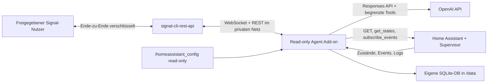

# Home Assistant Read-only Agent

<p align="center">
  
</p>

Ein Home-Assistant-Add-on, in dem ein OpenAI-Agent lebt, per Signal chattet und Home Assistant überwacht. Der Agent darf Zustände, Verlauf, Konfigurationen und Logs lesen. Er kann eigene persistente Cron-, Entity- und Event-Monitore anlegen, aber **keine Home-Assistant-Zustände oder Dateien verändern**.

Status: experimentelle, gehärtete Version für Home Assistant OS/Supervised auf `amd64` und `aarch64`.



## Was bereits funktioniert

- Signal-Nachrichten von einer Whitelist empfangen und beantworten
- Eigene Home-Assistant-Weboberfläche für sämtliche Einstellungen und Verbindungstests
- Aktuelle Entities suchen und Zustände/Attribute lesen
- Kompakten Entity-Verlauf bis sieben Tage lesen
- Home-Assistant-Core-Logs sowie gemountete Logdateien lesen und filtern
- Konfigurationsdateien auflisten, lesen, durchsuchen und auf YAML-Syntax prüfen
- Persistente fünfstellige Cron-Jobs nach separater Signal-Bestätigung anlegen
- Mehrere Geräte auf `unavailable`, `unknown` oder andere Zustände überwachen
- Beliebige Home-Assistant-Events mit einfachen Datenfiltern abonnieren
- Monitore auflisten, deaktivieren, aktivieren und löschen
- Neustarts überstehen; Monitore liegen in `/data/agent.sqlite3`

Nicht enthalten sind Schreibwerkzeuge, Shell-Zugriff, Service Calls, Event-Auslösung, Dateiänderungen oder Home-Assistant-Neustarts.

## Voraussetzungen

- Home Assistant OS oder eine Supervised-Installation mit Add-on-Unterstützung
- Ein OpenAI-API-Key. Ein ChatGPT-Abonnement allein ist kein API-Guthaben.
- Eine erreichbare [`signal-cli-rest-api`](https://github.com/bbernhard/signal-cli-rest-api)-Instanz im privaten Netz, bevorzugt im JSON-RPC-Modus
- Sinnvollerweise ein eigenes Signal-Konto für den Bot

Signal stellt keine offizielle Bot-API bereit. `signal-cli` und der REST-Wrapper sind Community-Projekte; Änderungen bei Signal können die Verbindung vorübergehend unterbrechen.

## 1. Signal-Bridge bereitstellen

Ein minimales Docker-Compose-Beispiel auf einem NAS, Server oder einer anderen vertrauenswürdigen Maschine:

```yaml
services:
  signal-api:
    image: bbernhard/signal-cli-rest-api:latest
    restart: unless-stopped
    environment:
      MODE: json-rpc
    ports:
      - "192.168.1.20:8080:8080"
    volumes:
      - ./signal-data:/home/.local/share/signal-cli
```

Die API darf nicht ungeschützt aus dem Internet erreichbar sein. Das Signal-Konto wird nach Anleitung des REST-Projekts registriert oder als Gerät verknüpft. Zum Verknüpfen liefert `GET /v1/qrcodelink?device_name=HomeAssistant-Agent` einen QR-Code, den man in Signal unter **Einstellungen → Verknüpfte Geräte** scannt.

## 2. Add-on installieren

Für die normale Installation diese Repository-URL unter **App-Store → Repositories** hinzufügen:

```text
https://github.com/SVENS0Nb/HA-AI-System-Agent
```

Danach im App-Store nach **HA AI System Agent** beziehungsweise **Home Assistant Read-only Agent** suchen und die App installieren.

### Lokale Installation

Für einen ersten Test den Unterordner [`homeassistant-readonly-agent`](./homeassistant-readonly-agent) in Home Assistants `/addons/homeassistant-readonly-agent` kopieren, beispielsweise über das Samba- oder SSH-Add-on. Danach:

1. **Einstellungen → Apps → App-Store** öffnen.
2. Im Menü **Nach Updates suchen** wählen.
3. Unter **Lokale Apps** den **Home Assistant Read-only Agent** öffnen und installieren.
4. Das Add-on starten; eine unvollständige Konfiguration startet zunächst nur die sichere Einstellungsoberfläche.
5. **Weboberfläche öffnen** wählen und dort Signal, OpenAI, Datenschutz und Laufzeit konfigurieren.
6. **Einstellungen speichern** und anschließend die drei Verbindungstests ausführen.

Das Repository enthält bereits die für den Home-Assistant-App-Store erforderliche `repository.yaml` mit der öffentlichen Projektadresse.

## 3. Einstellungsoberfläche

Die Weboberfläche wird durch Home Assistant Ingress bereitgestellt. Jeder Aufruf wird serverseitig anhand der von Home Assistant übergebenen Benutzer-ID gegen die aktuelle Administratorliste geprüft; `panel_admin` allein wird nicht als Sicherheitsgrenze verwendet. Port `8099` wird nicht nach außen veröffentlicht. Änderungen werden mit Dateirechten `0600` in `/data/ui-settings.json` gespeichert und der Agent wird automatisch neu geladen.

API-Keys und Proxy-Tokens werden nie wieder an den Browser zurückgegeben. Ein leeres Passwortfeld behält den bereits gespeicherten Wert bei. Ausnahme: Wird die Signal-URL geändert, wird ein vorhandener Proxy-Token nicht an das neue Ziel übernommen. Die Verbindungstests prüfen Home Assistant, Signal und OpenAI getrennt, sodass eine noch unvollständige andere Verbindung den jeweiligen Test nicht blockiert.

Die native Registerkarte **Konfiguration** bleibt als Fallback erhalten. Werte aus der eigenen Weboberfläche haben Vorrang.

## 4. Optionen

| Option | Bedeutung |
|---|---|
| `openai_api_key` | API-Key von OpenAI |
| `openai_model` | Modell-ID; voreingestellt ist `gpt-5.6-luna` |
| `reasoning_effort` | `none`, `low`, `medium`, `high`, `xhigh` oder `max` |
| `signal_api_url` | Interne URL der Signal-Bridge, z. B. `http://192.168.1.20:8080` |
| `signal_api_token` | Optionaler Bearer-Token eines vorgeschalteten Reverse Proxys |
| `signal_account` | Signal-Nummer des Bot-Kontos im E.164-Format |
| `allowed_senders` | Einzige Nummern, deren Nachrichten akzeptiert und an die Antworten gesendet werden |
| `timezone` | Zeitzone für Cron-Ausdrücke |
| `allow_sensitive_config` | Hebt den Standardschutz für Secrets/Auth-Dateien auf; nicht empfohlen |
| `startup_message` | Sendet nach dem Start eine Statusmeldung |
| `conversation_messages` | Lokal gespeicherter kurzer Chat-Kontext pro Absender |
| `max_config_file_kb` | Leselimit pro Konfigurationsdatei |
| `default_log_lines` | Standardgröße einer Logabfrage |
| `openai_timeout_seconds` | Zeitlimit pro OpenAI-Aufruf |
| `max_output_tokens` | Maximale Ausgabegröße pro Modellaufruf |
| `max_tool_rounds` | Maximale Anzahl aufeinanderfolgender Werkzeugrunden |
| `max_parallel_agent_runs` | Parallele Chats bzw. Diagnosen; pro Absender bleibt die Reihenfolge erhalten |
| `message_retention_days` | Maximale lokale Aufbewahrungsdauer des Chat-Kontexts |
| `max_messages_per_sender` | Mengenlimit des lokalen Chat-Kontexts pro Absender |
| `max_monitors_per_sender` | Obergrenze persistenter Monitore pro Absender |
| `reconcile_interval_seconds` | Regelmäßiger Statusabgleich für verpasste Entity-Ereignisse |

## Beispielgespräche

> Welche meiner Zigbee-Geräte sind gerade nicht erreichbar?

> Überwache `sensor.heizung_vorlauf` und `binary_sensor.keller_pumpe`. Melde dich, wenn eines davon mindestens fünf Minuten `unavailable` oder `unknown` ist.

> Prüfe jeden Morgen um 07:30 die Core-Logs auf neue Fehler und schicke mir eine kurze Zusammenfassung.

> Suche in allen YAML-Dateien nach `!secret` und prüfe anschließend die YAML-Syntax von `configuration.yaml`.

> Zeige meine aktiven Monitore und deaktiviere den Heizungsmonitor.

Bei jeder dauerhaften Monitoränderung antwortet der Agent zunächst mit einem Code. Erst eine zweite Nachricht im Format `BESTÄTIGEN 1a2b3c4d` führt die vorgeschlagene Änderung aus. `ABBRECHEN` verwirft alle offenen Vorschläge des Absenders.

## Read-only-Sicherheitsmodell

Home Assistant bietet Add-ons derzeit keinen fein gescopten Nur-Lese-Token. Das Add-on erzwingt die Grenze deshalb in mehreren Schichten:

- `/config` ist vom Supervisor read-only gemountet.
- Der Home-Assistant-Adapter implementiert REST ausschließlich mit `GET`.
- Auf der WebSocket-Verbindung sind nur lesende Zustands-/Event-Kommandos und die admin-geschützte Benutzerliste für die UI-Autorisierung zugelassen.
- Der OpenAI-Agent sieht niemals den Supervisor-Token.
- Es gibt kein generisches HTTP-, Shell-, Datei-Schreib- oder Service-Call-Werkzeug.
- Schreibzugriffe betreffen ausschließlich die eigene Monitor-Datenbank in `/data`.
- Die Einstellungsoberfläche akzeptiert nur Verbindungen des Home-Assistant-Ingress-Proxys und ist auf Administratoren begrenzt.
- Signal-Eingang und -Ausgang sind auf `allowed_senders` begrenzt; Monitore gehören dem Ersteller.
- Inhalte aus Logs, Konfigurationen und Events werden als nicht vertrauenswürdige Daten behandelt und vor Modellaufrufen lokal auf typische Secrets geprüft.
- Dauerhafte Monitoränderungen benötigen eine vom Modell unabhängige, exakt passende Signal-Bestätigung und laufen nie aus proaktiven Agentläufen heraus.

Der Supervisor-Token besitzt technisch mehr Rechte als der Adapter nutzt. Bei einer vollständigen Kompromittierung des Containerprozesses wäre diese programminterne Grenze nicht mit einem serverseitig gescopten Token gleichzusetzen. Das Add-on sollte daher geschützt, aktuell und nur mit einer privaten Signal-Bridge betrieben werden.

Standardmäßig blockiert der Dateileser `secrets.yaml`, die komplette `.storage`-Struktur, `.cloud` und weitere sensible Bestände. Zusätzlich werden typische Schlüssel/Werte, Bearer-Tokens, OpenAI-Keys, URL-Zugangsdaten und Private-Key-Blöcke lokal geschwärzt. Diese Erkennung ist eine zusätzliche Schutzschicht, aber keine mathematische Garantie für jedes denkbare Geheimnis. Auch gewöhnliche Sensorwerte und Logs werden bei einer Analyse an die OpenAI API übertragen. Vor dem Einsatz sollten Datenschutz und Aufbewahrungsanforderungen geprüft werden.

Add-on-übergreifende Supervisor-Logs werden bewusst nicht angeboten: Die dafür nötige Rolle würde die Berechtigungen des Containers erheblich ausweiten. Core-Logs und lesbare Dateien im read-only Konfigurations-Mount bleiben verfügbar.

## Entwicklung und Tests

```bash
python3 -m venv .venv
. .venv/bin/activate
pip install -r homeassistant-readonly-agent/requirements.txt
python -m unittest discover -s tests -v
python -m compileall -q homeassistant-readonly-agent/app
```

## Quellen der Schnittstellen

- [Home Assistant App-Konfiguration](https://developers.home-assistant.io/docs/apps/configuration/)
- [Home Assistant Ingress und Präsentation](https://developers.home-assistant.io/docs/apps/presentation/)
- [Home Assistant App-Kommunikation](https://developers.home-assistant.io/docs/apps/communication/)
- [Home Assistant WebSocket API](https://developers.home-assistant.io/docs/api/websocket/)
- [Home Assistant Supervisor-Endpunkte](https://developers.home-assistant.io/docs/api/supervisor/endpoints/)
- [OpenAI Function Calling](https://developers.openai.com/api/docs/guides/function-calling)
- [Signal CLI REST API](https://github.com/bbernhard/signal-cli-rest-api)
